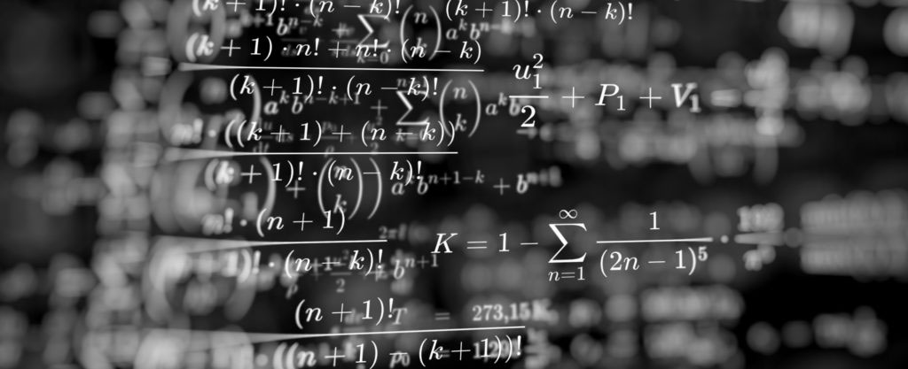

# Academics
This repository is dedicated to my academic life, mainly for the purpose of showcasing some of the major transferrable projects that I have acquired in over 12 years of living in academia, from undergraduate to PhD. Some of these skills are as follows: analytical thinking, time management, project management, quantitative and qualitative skills and research skills. [My academic CV can be found here](https://drive.google.com/file/d/1ITlkwcnUVF85qjkpPhkJ4s8CWt6H3TVl/view?usp=sharing)

## Undergraduate
I did my undergraduate in Mathematics and Applications at Amirkabir University of Technology (Tehran Polytechnic). While my focus and final thesis was on mathematical logics, I had deep exposure to various pure and applied mathematics subjects, mostly in terms of coursework. 

Among these are the following topics, for each one or more course was taken:
- Statistics
- Probability Theory
- Numerical Analysis
- Optimization Theory
- Linear Algebra
- Abstract Algebra
- Calculus, Real Analysis, Complex Analysis
- Differential Equations
- Euclidean, Differential, Manifold and Algebraic Geometry
- Logic, Set Theory, Model Theory, Category Theory

My thesis was one an advanced topic in the crossovers of category theory and modal logics: coalgebraic logics. My thesis, titiled *Logics for Coalgebras, and a Final Coalgebra Theorem (written in Persian)* can be found [here](http://amirkiani.ucalgaryblogs.ca/files/2020/10/Logics-For-Coalgebras-and-a-Final-Coalgebra-Theorem.pdf).

Aside from perseverance and responsibilty, some major skills that I acquired during my bachelor's program were advanced quantitative and logical reasoning as a result of engaging with various forms of mathematical concepts.

## Master's Degree
....

## PhD

...
